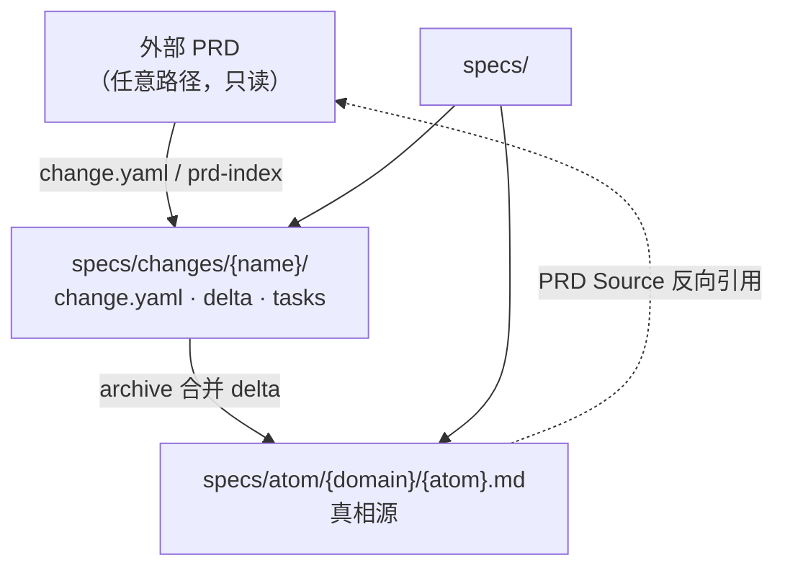
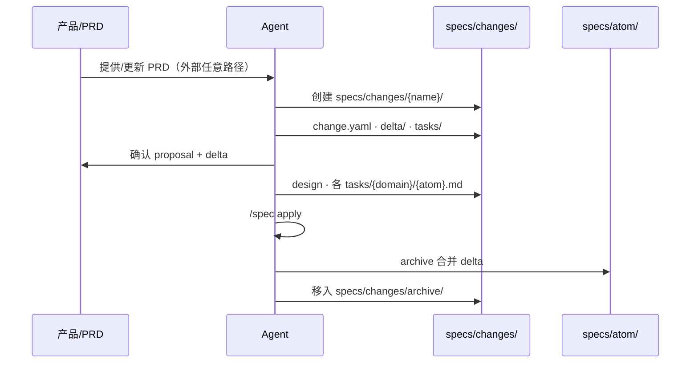

# PRD-Spec 架构设计

> 轻量级需求规格体系：融合 OpenSpec 的 change/delta 模型与 Superpowers 的分级流程纪律。
>
> 设计目标：**混合格式（YAML change + MD atom/tasks）、按需分级、无重型 CLI、PRD 可追溯但不绑定复杂工具链。**

--- 

## 1. 设计原则

| 原则 | 来源 | 含义 |
|------|------|------|
| **Fluid not rigid** | OpenSpec | 无强制阶段门，artifact 是 enabler 不是 gate |
| **Progressive rigor** | OpenSpec + Superpowers | 小任务轻流程，大任务才写全量 artifact |
| **Brownfield-first** | OpenSpec | delta spec 描述变更，不全量复制 |
| **Approval scales with risk** | Superpowers | 每条路径都有确认，但 artifact 厚度随任务缩放 |
| **PRD ≠ Spec** | 本设计 | PRD 是产品输入（形态可乱）；Spec 是可测试的行为契约 |
| **Hybrid format** | 本设计 | **YAML** 管 change 元数据；**Markdown** 管 atom 正文与 tasks |
| **Single output root** | 本设计 | 工作流**全部产出**集中在 `specs/`；无顶层 `changes/` |
| **Scheme B** | 本设计 | `delta/` 与 `tasks/` 均镜像 `specs/atom/{domain}/{atom}.md` |

### 与重型方案的对比

| 维度 | 重型 Spec 方案 | PRD-Spec（本设计） |
|------|----------------|-------------------|
| 格式 | YAML + MD 双写全链路 | YAML change + MD atom/tasks |
| 工具 | 专用 CLI + Python 插件 | 可选 `openspec` CLI，Skill 可独立运行 |
| 流程 | 固定 6+ 决策点 + 状态机 | 3 条路径，确认门按风险缩放 |
| PRD 更新 | compare → affected_specs → delta | `change.yaml` + delta |
| 验收 | CLI verify 写回 YAML | Scenario 即验收清单 + TDD tasks |

---

## 2. 目录结构

**唯一产出根目录：`specs/`**。行为规格、变更工作区、PRD 索引、可选 PRD 副本——凡本体系**写出**的文档，都在此树下。

外部 PRD（产品已有文档）仍可在仓库**任意路径**只读引用；若需纳入管理，可复制或链接登记到 `specs/prd-index.md`。

### 2.1 标准结构

```
project/
├── specs/                              # ★ 唯一产出根
│   ├── README.md                       # 领域索引 + 工作流说明
│   ├── .prd-spec.yaml                  # 可选配置（见 §3.4）
│   ├── prd-index.md                    # 可选：外部 PRD 输入登记
│   ├── prd/                            # 可选：纳入 specs 管理的 PRD 副本/整理稿
│   │   └── 用户登录.md
│   │
│   ├── atom/                           # ★ 需求 spec 真相源（原子化）
│   │   ├── auth/
│   │   │   ├── sms-login.md            # 一个 atom = 一个可独立验收的需求单元
│   │   │   └── session.md
│   │   └── billing/
│   │       └── checkout.md
│   │
│   └── changes/                        # 变更工作区
│       ├── add-sms-login/
│       │   ├── change.yaml             # ★ 变更记录（YAML：映射、状态、PRD 追溯）
│       │   ├── proposal.md
│       │   ├── design.md
│       │   ├── delta/                  # 需求 delta，镜像 atom/
│       │   │   └── auth/
│       │   │       └── sms-login.md
│       │   └── tasks/                  # 实现任务，镜像 atom/（方案 B）
│       │       └── auth/
│       │           └── sms-login.md
│       └── archive/
│           └── 2026-08-27-add-sms-login/
│
├── PRD.md                              # 外部输入示例（只读引用，非必须在此）
└── src/                                # 代码（不在 specs/ 内）
```

### 2.2 子目录职责

| 路径 | 性质 | 内容 |
|------|------|------|
| `specs/atom/{domain}/{atom}.md` | **真相源** | 已 archive 的原子需求 spec |
| `specs/changes/{name}/change.yaml` | **变更记录** | 状态、PRD 输入、atom 映射（机器读） |
| `specs/changes/{name}/delta/` | **需求 delta** | 镜像 `specs/atom/{domain}/{atom}.md` |
| `specs/changes/{name}/tasks/` | **实现任务** | 镜像路径；**不** merge 进真相源 |
| `specs/changes/{name}/` | **进行中** | change.yaml、proposal、design |
| `specs/changes/archive/` | **历史** | 含完整 delta + tasks + change.yaml |
| `specs/prd-index.md` | **输入登记** | 外部 PRD → domain/atom 映射 |
| `specs/prd/` | **可选副本** | 从外部 PRD 整理或复制的 MD |

### 2.3 外部 PRD 与 specs 内产出的关系

| 类型 | 位置 | 是否 specs 产出 |
|------|------|-----------------|
| 产品原有 PRD | 根目录、`docs/`、`requirements/` 等任意处 | 否，只读引用 |
| PRD 索引 | `specs/prd-index.md` | 是 |
| PRD 整理副本 | `specs/prd/*.md` | 是（可选） |
| 行为规格（atom） | `specs/atom/{domain}/{atom}.md` | 是 |
| 变更 artifact | `specs/changes/**` | 是 |

**路径写法**：外部 PRD 在 `change.yaml` / `prd-index.md` 中用仓库根相对路径；`change.yaml` 内 `delta`/`tasks` 路径相对 change 目录。

### 2.4 格式分工（YAML vs Markdown）

| 内容 | 格式 | 路径 |
|------|------|------|
| 变更状态、atom 映射、PRD 追溯 | **YAML** | `changes/{name}/change.yaml` |
| 需求 Requirement / Scenario | **Markdown** | `delta/{domain}/{atom}.md` → archive → `atom/` |
| 实现 TDD 任务（方案 B） | **Markdown** | `tasks/{domain}/{atom}.md`（留 archive，不进真相源） |
| 意图、技术方案叙述 | **Markdown** | `proposal.md`、`design.md` |

### 2.5 常见布局

| 场景 | 做法 |
|------|------|
| 小项目 | `specs/atom/` + `specs/changes/`；PRD 用根目录 `PRD.md` |
| PRD 分散 | `specs/prd-index.md` 登记；change 内 `change.yaml` 引用 |
| 单 atom 小改 | `change.yaml` + `delta/.../x.md` + `tasks/.../x.md` |
| monorepo | 每包自有 `specs/`，或 monorepo 根单一 `specs/` |

### 三层职责



| 层 | 路径 | 回答的问题 |
|----|------|-----------|
| **外部 PRD** | 仓库任意处 | 产品原始意图 |
| **Change** | `specs/changes/{name}/` | 这次改什么、怎么做 |
| **Atom Spec** | `specs/atom/{domain}/{atom}.md` | 单个需求单元当前行为是什么 |

---

## 3. PRD 输入层（兼容多种形态）

PRD 是**产品意图的自然语言输入**，不是 Spec 的镜像。现实中 PRD 来源杂乱——本架构**不强制统一模板**，只要求能追溯、能映射到 Spec。

### 3.1 设计原则

| 原则 | 含义 |
|------|------|
| **输入宽容，输出严格** | PRD 可以乱；Spec / delta 必须结构化 |
| **位置不限（输入）** | 外部 PRD 可在任意路径；**产出**必须在 `specs/` |
| **推荐 ≠ 强制** | `specs/prd/`、`templates/prd_template.md` 均为可选 |
| **保留原文** | 外部 PRD 不强制搬迁；可选复制到 `specs/prd/` |
| **追溯可降级** | 有章节用 §；无章节用路径 + 行号 / 摘录 / 链接 |

### 3.2 支持的 PRD 形态

| 形态 | 典型来源 | 存放建议（均可换路径） | Agent 处理 |
|------|----------|------------------------|------------|
| **Canonical** | 团队标准 PRD | 外部任意路径，或 `specs/prd/` | 解析 → `specs/changes/.../delta/` |
| **Source** | 飞书/Notion 导出 | 外部或 `specs/prd/sources/` | 整理后写入 change |
| **Patch** | 口头变更、工单 | 外部或 `specs/prd/patches/` | 写入 `change.yaml` |
| **Inline** | 聊天几句话 | — | Spike/Bounded 进 proposal；Architectural 落盘到 `specs/changes/` |
| **Multi-doc** | 多份文档 | 外部多路径 + `specs/prd-index.md` | 索引标明有效组合 |
| **Versioned** | 历史版本并存 | 外部或 `specs/prd/` | 增量对比登记两版路径 |
| **Legacy** | 无章节、纯列表 | 保持外部原位置 | 语义抽取 |
| **External** | 仅在线文档 | URL 记入 `change.yaml` 或 `prd-index.md` |

**无 PRD 也合法**：Bounded / Spike 路径可不依赖 PRD；只有 Architectural 且声称「PRD 驱动」时才要求可追溯输入。

### 3.3 推荐结构（Canonical 可选）

团队若希望统一写法，可使用 `templates/prd_template.md`。**缺失章节不阻塞流程**——Agent 从现有内容抽取，缺项标 `[待补充]`。

```markdown
# 用户登录

> 版本：v1.1 | 状态：已评审 | 更新：2026-08-27

## 1. 背景与目标
## 2. 用户故事
## 3. 功能需求
### 3.1 手机号+验证码登录
## 4. 非功能需求
## 5. 不在范围
```

常见变体及兼容方式：

| PRD 实际写法 | 映射到 Spec 时 |
|--------------|----------------|
| 「需求说明」「功能描述」代替「功能需求」 | 同等对待，按标题层级或列表项抽取 |
| 只有表格（字段/规则） | 每行或每组规则 → 一个 Requirement 候选 |
| 只有用户故事，无细则 | 故事 → Purpose；细则标 `[待确认]` 进 proposal |
| 中英文混排、附件链接 | `change.yaml` 的 `prd_inputs` + `locate` |
| 一个文件多个无关模块 | README 拆条索引，按模块分别建 change |

### 3.4 PRD 索引（`specs/prd-index.md`，可选）

多模块或 PRD 分散时，在 **`specs/prd-index.md`** 登记外部输入；每个 change 的 **`change.yaml`** 登记本 change 用到的 PRD 与 atom 映射。小项目可省略 prd-index。

配置（`specs/.prd-spec.yaml`，可选）：

```yaml
version: 1
root: specs
prd_index: specs/prd-index.md
```

索引示例：

```markdown
# PRD 输入索引

| 模块 | 有效输入 | 类型 | 关联 atom/domain | 备注 |
|------|----------|------|----------|------|
| 全站 | PRD.md | external | — | 仓库根，外部 |
| 用户登录 | specs/prd/用户登录.md | canonical | auth/ | specs 内副本 |
| 用户登录 | docs/补丁_验证码.md | patch | auth/ | 外部补丁 |
| 订单 | requirements/订单.md | external | billing/ | 外部只读 |
| 支付 | https://feishu.cn/doc/xxx | external | billing/ | URL |

## 有效组合

- **用户登录** = `PRD.md` + `docs/补丁_验证码.md`
- **用户登录（specs 内）** = `specs/prd/用户登录.md`
```

| 字段 | 说明 |
|------|------|
| 有效输入 | 仓库根相对路径，或 URL；`specs/prd/` 开头表示 specs 内副本 |
| 关联 atom | 对应 `specs/atom/{domain}/{atom}.md` |

### 3.5 版本与变更策略（灵活）

不强制 `模块名_vX.Y.md` 文件名。任选一种团队习惯即可：

| 策略 | 适用 | 做法 |
|------|------|------|
| **单文件演进** | 小团队、迭代快 | 只维护 `canonical/模块.md`，文内改版本号 |
| **文件留历史** | 需审计 | `sources/模块_v1.0.md`、`模块_v1.1.md` 并存 |
| **补丁叠加** | 口头变更多 | canonical 不动，变更进 `patches/` |
| **仅 source** | 产品不写规范 PRD | 不建 canonical，每次 change 引用 source + 摘录 |

增量更新：对比 `specs/prd-index.md` 有效组合，更新新 change 的 `change.yaml`（`atoms[].operation`）。

### 3.6 外部与非 Markdown 输入

| 格式 | 处理 |
|------|------|
| PDF / Word | 转为 MD 存任意路径，或仅保留二进制 + 索引登记 |
| 飞书 / Notion / 语雀 | 导出 MD 或 URL 记入 `change.yaml` / `prd-index.md` |
| 纯聊天 / 会议 | 整理为 `specs/prd/patches/` 或 `change.yaml` / `proposal.md` |

**铁律**（Architectural + PRD 驱动）：须有 **`change.yaml`**（`prd_inputs` + `atoms`）；**全部产出在 `specs/` 下**。

### 3.7 Agent 解析 PRD 的兼容规则

不假设 PRD 有固定章节，按以下优先级抽取：

1. **显式结构**：编号章节、`###` 标题、表格 → 直接映射
2. **语义块**：连续列表、用户故事、「作为…我希望…」→ Requirement 候选
3. **约束句**：含「必须/不得/不超过/秒/次」→ Scenario 或规则条目
4. **模糊处**：写入 proposal `Open Questions` 或 Spec `[待确认]`，**不编造**
5. **冲突**：多份输入矛盾 → 在 proposal 列出冲突，**等人裁定**，不自动合并

与 Spec 的粗映射（章节名可替换）：

| PRD 中常见内容 | Spec 落点 |
|----------------|-----------|
| 背景、目标、故事 | `Purpose`、proposal `Intent` |
| 功能点、规则、交互 | `Requirement` |
| 边界、异常、数值限制 | `Scenario`（GWT） |
| 不做、后续、Out of scope | proposal `Out`、`Non-Goals` |
| 性能、安全、合规 | Full spec 的 NFR 或独立 Requirement |

---

## 4. Atom Spec 文档规范

**需求 spec 一律写在 `specs/atom/` 下**，不按领域合并成大文件；每个 **atom** 是一个可独立验收的原子需求单元。

### 4.1 什么是 Atom

| 概念 | 说明 |
|------|------|
| **domain** | 业务能力目录，如 `auth/`、`billing/` |
| **atom** | 单个 spec 文件，如 `sms-login.md`；通常对应 PRD 一个功能点或一组紧密相关的 Requirement |
| **路径** | `specs/atom/{domain}/{atom-slug}.md` |
| **命名** | `{atom-slug}` 用英文 kebab-case，如 `sms-login`、`session-ttl` |

```
specs/atom/
├── auth/
│   ├── sms-login.md       # 验证码登录
│   └── session.md         # 会话管理
├── billing/
│   └── checkout.md
└── README.md              # 可选：atom 清单
```

`specs/changes/{name}/delta/` 与 `tasks/` **均镜像** `specs/atom/{domain}/{atom}.md` 路径。

### 4.2 领域组织

按 **domain** 分子目录，每个 atom 一个文件（OpenSpec Requirement + Scenario 格式）：

```
specs/
├── atom/                  # 需求 spec 唯一真相源
│   └── auth/sms-login.md
└── changes/...
```

### 4.3 Atom 模板（Lite — 默认）

```markdown
# 手机号验证码登录

> Atom: auth/sms-login | 领域: auth

## Purpose
支持手机号 + 6 位数字验证码登录。

## Requirements

### Requirement: 验证码登录
系统 SHALL 支持手机号 + 6 位数字验证码登录。

#### Scenario: 验证码正确
- GIVEN 用户已获取未过期的验证码
- WHEN 用户提交正确手机号和验证码
- THEN 返回有效 token
- AND 创建用户会话

#### Scenario: 验证码过期
- GIVEN 验证码已超过 10 分钟
- WHEN 用户提交该验证码
- THEN 返回「验证码已过期」错误

#### Scenario: 发送频率限制
- GIVEN 用户 60 秒内已发送过验证码
- WHEN 用户再次请求发送
- THEN 返回「请稍后再试」错误

## PRD Source
- `docs/用户登录.md` §3.1
```

### 4.4 Atom 模板（Full — 高风险变更）

在 Lite 基础上增加：

```markdown
## Non-Goals
- 不支持邮箱登录（见 `specs/changes/xxx/proposal.md`）

## Dependencies
- 依赖 `specs/atom/notifications/sms-send.md` 的短信发送能力

## Open Questions
- [ ] 锁定期间是否允许客服解锁？
```

### 4.5 RFC 2119 关键词

| 词 | 含义 |
|----|------|
| **MUST / SHALL** | 绝对要求 |
| **SHOULD** | 推荐，可有例外 |
| **MAY** | 可选 |

### 4.6 何时用 Lite vs Full

| 场景 | 级别 |
|------|------|
| 单模块小功能、阈值调整 | Lite |
| 跨模块、API 契约变更、安全/合规 | Full |
| 新子系统首次建仓 | Full |

---

## 5. Change 工作流

### 5.1 路径分级（来自 Superpowers）

Agent 接到任务后**必须先分类**，并口头告知用户：

| 路径 | 适用场景 | 产出 artifact | PRD 是否必须 |
|------|----------|---------------|-------------|
| **Spike** | 可行性探索（「能不能…」「快速试一下」） | 口头/简短报告 | 否 |
| **Bounded** | 小改动 | `change.yaml` + `tasks/{domain}/{atom}.md` | 否 |
| **Architectural** | 新功能、PRD 驱动 | `specs/changes/{name}/` 全套 artifact | 是（若有 PRD） |

**升级规则**：任务中途发现复杂度超预期 → 立即升级路径，不可降级。

```
Spike ──发现需保留代码──► Bounded 或 Architectural
Bounded ──影响面扩大──► Architectural
```

### 5.2 Change 文件夹（位于 `specs/changes/`）

```
specs/changes/add-sms-login/
├── change.yaml             # 必填：状态、映射、PRD 追溯
├── proposal.md             # Architectural 必填
├── design.md               # Architectural 必填；Bounded 可省略
├── delta/                  # 需求 delta，镜像 specs/atom/
│   └── auth/
│       └── sms-login.md
└── tasks/                  # 实现任务，镜像路径（方案 B）
    └── auth/
        └── sms-login.md
```

### 5.3 Artifact 依赖（OpenSpec enabler 模型）

```
proposal ──► change.yaml + delta ──► design ──► tasks/{domain}/{atom}.md ──► implement ──► archive
   why              what + 映射           how              steps
```

- **`change.yaml`** 与 `delta/`、`tasks/` 同步维护；`atoms[]` 为映射真相源
- **implement 前**：`change.yaml` 中 `tasks.confirmed: true`，且相关 `tasks/**/*.md` 已获用户确认

### 5.4 Delta Spec 格式

```markdown
# Delta for Auth

## ADDED Requirements

### Requirement: 手机号验证码登录
系统 SHALL 支持手机号 + 6 位数字验证码登录。

#### Scenario: 验证码正确
- GIVEN 用户已获取未过期的验证码
- WHEN 用户提交正确手机号和验证码
- THEN 返回有效 token

## MODIFIED Requirements

### Requirement: Session Expiration
会话 MUST 在 30 分钟无操作后过期。
（Previously: 60 分钟）

#### Scenario: 空闲超时
- GIVEN 已认证会话
- WHEN 30 分钟无操作
- THEN 会话失效

## REMOVED Requirements

### Requirement: 密码登录
（v1.1 起废弃，统一验证码登录）
```

| Section | 含义 | Archive 行为 |
|---------|------|-------------|
| `ADDED` | 新行为 | 追加到主 spec |
| `MODIFIED` | 修改行为 | 替换原 requirement |
| `REMOVED` | 废弃行为 | 从主 spec 删除 |

### 5.5 变更记录（`change.yaml`）

每个 change **必填** `change.yaml`（模板见 `templates/change.yaml`）。替代原 `prd-trace.md`，负责：

| 字段 | 用途 |
|------|------|
| `status` | `draft` → `in_progress` → `done` → `archived` |
| `path` | `spike` / `bounded` / `architectural` |
| `prd_inputs` | 外部 PRD 路径 / URL + 定位 |
| `atoms[]` | `domain`、`atom`、`operation`、`delta`、`tasks`、`target` |
| `tasks.confirmed` | apply 前须为 `true` |
| `tasks.complete` | archive 前须为 `true` |
| `archive.at` | archive 时写入日期 |

`atoms[].tasks` 指向 `tasks/{domain}/{atom}.md`，与 `atoms[].delta` 成对出现。

### 5.6 实现任务（方案 B：`tasks/{domain}/{atom}.md`）

- **一 atom 一 task 文件**，路径与 `delta/{domain}/{atom}.md` 镜像
- 只写 HOW（TDD 步骤），不写 Requirement 正文
- **不** merge 进 `specs/atom/`；随 change 进入 `archive/`
- 多 atom 时各有独立 `tasks/auth/sms-login.md`、`tasks/auth/session.md` 等

```markdown
# Tasks: auth/sms-login

> Delta: delta/auth/sms-login.md
> Design: design.md

- [ ] 1.1 写失败测试：验证码正确返回 token
- [ ] 1.2 跑 FAIL → 实现 → PASS
```

### 5.7 Archive 流程

1. 确认 `change.yaml` 中 `tasks.complete: true`，且各 `tasks/**/*.md` checkbox 已完成
2. 将 `delta/{domain}/{atom}.md` 合并到 `specs/atom/{domain}/{atom}.md`（ADDED 新建、MODIFIED 替换、REMOVED 删文件）
3. 更新 `change.yaml`：`status: archived`，`archive.at` 填日期
4. 更新 `specs/README.md`（推荐）
5. 移动整个 change 到 `specs/changes/archive/YYYY-MM-DD-{name}/`（含 `tasks/` 历史）

**禁止**在有活跃 change 时直接改 `specs/atom/`（应改 `delta/`）。

## 6. Artifact 模板要点

### proposal.md

```markdown
# Proposal: 手机号验证码登录

## Intent
用户反馈密码登录繁琐，需支持手机号+验证码快速登录。

## Scope
**In:**
- 验证码发送与校验
- 登录态创建

**Out:**
- 密码登录（废弃）
- 第三方 OAuth

## Approach
复用现有短信服务，新增 auth 模块验证码接口。
```

### design.md

```markdown
# Design: 手机号验证码登录

## 技术方案
- `POST /api/auth/sms/send` 发送验证码
- `POST /api/auth/sms/login` 验证码登录
- Redis 存储验证码，TTL 600s

## 关键决策
| 决策 | 选择 | 原因 |
|------|------|------|
| 验证码存储 | Redis | 项目已有，支持 TTL |
| 频率限制 | 内存 + Redis | 60s 窗口 |

## 文件变更
- `src/auth/sms-login.ts` (new)
- `src/auth/__tests__/sms-login.test.ts` (new)
```

### tasks/{domain}/{atom}.md（方案 B）

```markdown
# Tasks: auth/sms-login

> Delta: delta/auth/sms-login.md
> Design: design.md

- [ ] 1.1 写失败测试：有效手机号应返回 200
- [ ] 1.2 跑 FAIL → 实现 sendSmsCode → PASS
- [ ] 1.3 写失败测试：60s 重复发送返回 429
- [ ] 1.4 实现频率限制 → PASS
```

---

## 7. Skill 工作流命令

> 端到端流程、路径分级、确认门、示例见 **[WORKFLOW.md](./WORKFLOW.md)**。

轻量 slash command，不依赖专用 CLI：

| 命令 | 触发场景 | 动作 |
|------|----------|------|
| `/spec explore` | 需求不清晰 | 读 PRD/代码，澄清问题，**不写代码** |
| `/spec propose` | PRD 更新或新功能 | 分类路径 → 创建 `specs/changes/{name}/` |
| `/spec apply` | 设计已确认 | 按 `tasks/{domain}/{atom}.md` TDD 实现；`change.yaml` 设 `tasks.confirmed: true` |
| `/spec archive` | 实现完成 | delta → `specs/atom/`；`change.yaml` → archived；移入 archive/ |

### Agent 执行规则

1. **先分类**：Spike / Bounded / Architectural，写入 `change.yaml` 的 `path`
2. **先确认再写代码**：确认门厚度随路径缩放
3. **propose 时**：创建 `change.yaml`，同步维护 `atoms[]` 与 `delta/`、`tasks/` 路径
4. **apply 前**：`tasks.confirmed: true`；每个 atom 的 `tasks/{domain}/{atom}.md` 已确认
5. **TDD**：任务写入对应 atom 的 task 文件，不写进 delta 正文
6. **archive 前**：`tasks.complete: true`

### 确认门（按路径缩放）

| 路径 | 确认方式 |
|------|----------|
| Spike | 口头确认探针方案 |
| Bounded | 聊天内 2-3 句设计 + 用户说「可以」 |
| Architectural | proposal → delta → design → **各 atom 的 tasks 文件** 确认 |

---

## 8. PRD → Spec 转换流程



### PRD 解析规则

**不假设 PRD 有固定章节**（详见 §3.7）。在已识别的输入上：

1. **背景 / 故事 / 目标**（任意标题）→ Spec `Purpose`、proposal `Intent`
2. **功能点 / 规则 / 列表项** → `Requirement`（一条可验证行为 ≈ 一个 Requirement）
3. **边界、异常、数值** → `Scenario`（GIVEN/WHEN/THEN）
4. **不做 / 后续** → proposal `Out`、spec `Non-Goals`
5. **未提及** → `[待确认]`，不编造
6. **多份输入** → 以 `specs/prd-index.md` 有效组合为准；冲突须人工裁定

### 增量 PRD 更新

对比 `specs/prd-index.md` 中登记的有效组合：

1. Agent 语义 diff
2. 新 change 的 `change.yaml` 更新 `atoms[].operation`
3. 只写受影响的 `delta/` 与配对 `tasks/`
4. propose → apply → archive

---

## 9. 多人协作

| 场景 | 策略 |
|------|------|
| A、B 改不同领域 | 各自 `specs/changes/{name}/`，archive 无冲突 |
| A、B 改同一领域 | Git PR 冲突；以最新 PRD 重跑 propose |
| 有人直接改 `specs/atom/` | 禁止（有活跃 change 时）；应改 `delta/` |
| 产品更新 PRD | 新建 `specs/changes/{name}/`，不直接改 atom |

---

## 10. 可选工具集成

本架构**不强制**任何 CLI。按需选用：

| 工具 | 用途 | 是否必须 |
|------|------|----------|
| [OpenSpec CLI](https://github.com/Fission-AI/OpenSpec) | `openspec validate` 校验 delta 格式 | 否 |
| Git | change 隔离、archive 历史 | 是 |
| 测试框架 | TDD 执行 | 是（项目已有） |

若安装 OpenSpec CLI，可将本仓库 `specs/` 映射为 OpenSpec 的 `openspec/specs/` + `openspec/changes/`（目录等价，Skill 逻辑不变）。

---

## 11. 文档与 Skill 结构（建议）

**设计文档（本仓库）：**

```
docs/prd-spec/
├── README.md
├── WORKFLOW.md                 # 工作流
├── ARCHITECTURE.md             # 架构
└── templates/
```

**Skill 实现（待建）：**

```
skills/prd-spec/
├── SKILL.md                    # 主指令（引用 WORKFLOW.md）
├── references/
│   ├── paths.md
│   ├── prd-format.md
│   └── spec-format.md
└── assets/                     # 或链到 docs/prd-spec/templates/
    ├── specs-README_template.md
    ├── prd_template.md
    ├── atom_template.md
    ├── spec_template.md            # 兼容别名，优先 atom_template
    ├── delta_template.md
    ├── proposal_template.md
    ├── design_template.md
    ├── tasks_template.md
    ├── change.yaml
    └── prd-spec.config.yaml
```

---

## 12. 迁移检查清单

从重型 Spec 方案迁移时：

- [ ] 建立 `specs/atom/{domain}/`、`specs/changes/`、`specs/prd-index.md`（可选）
- [ ] 删除顶层 `changes/`、`.wetspec.yaml` 等旧结构
- [ ] 外部 PRD 登记在 `change.yaml` 或 `specs/prd-index.md`
- [ ] 活跃变更移入 `specs/changes/`
- [ ] 归档到 `specs/changes/archive/`

---

## 附录 A：术语表

| 术语 | 定义 |
|------|------|
| **PRD** | 产品需求文档，描述用户要什么 |
| **Spec** | 行为规格，描述系统对外表现什么 |
| **Atom** | `specs/atom/{domain}/{atom}.md` 原子需求 spec |
| **Domain** | atom 的上级目录，如 `auth/` |
| **Delta** | `specs/changes/{name}/delta/` 内相对 atom 的 ADDED/MODIFIED/REMOVED |
| **Archive** | delta 合并到 `specs/atom/`，change 移入 `specs/changes/archive/` |
| **Change** | `specs/changes/{name}/` 内的一次变更工作单元 |
| **Change record** | `change.yaml`：状态、PRD、atom 映射 |
| **Artifact** | proposal / design / delta / tasks（按 atom） |
| **Path** | Superpowers 三级路径：Spike / Bounded / Architectural |

## 附录 B：设计决策记录

| 决策 | 选择 | 放弃 | 原因 |
|------|------|------|------|
| Spec 格式 | YAML change + MD atom/tasks | YAML 全链路双写 | 机器读字段用 YAML，正文用 MD，避免双写同步 |
| 任务组织 | 方案 B：`tasks/{domain}/{atom}.md` | change 级单文件 tasks.md | 与 delta/atom 路径镜像，多 atom 可并行 |
| PRD 追溯 | `change.yaml` + 可选 prd-index | prd-trace.md 表格 | 结构化映射 + 状态门禁，Agent 易解析 |
| 流程门控 | 按路径缩放确认 | 固定 6+ 决策点 | 小任务不被流程拖累 |
| 产出根 | 仅 `specs/` | 顶层 `changes/`、`docs/prd/` | 一处找全 spec 相关产出 |
| PRD 输入 | 外部任意路径 + `specs/prd-index.md` | 强制集中目录 | 读散、写聚 |
| Atom 组织 | `specs/atom/{domain}/{atom}.md` | 领域级 `spec.md` 大文件 | 原子化、独立验收、增量 archive |
| 状态管理 | `specs/changes/` + git | 专用状态机 YAML | 无额外运行时依赖 |
| 验收 | Scenario + TDD tasks | CLI verify 回写 | 与 Superpowers 工作流一致 |
