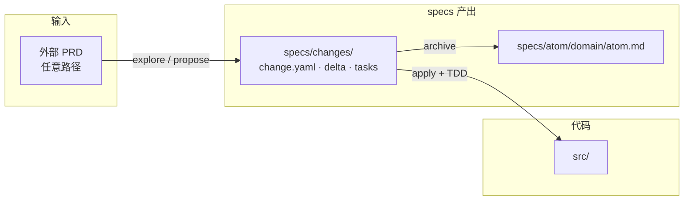
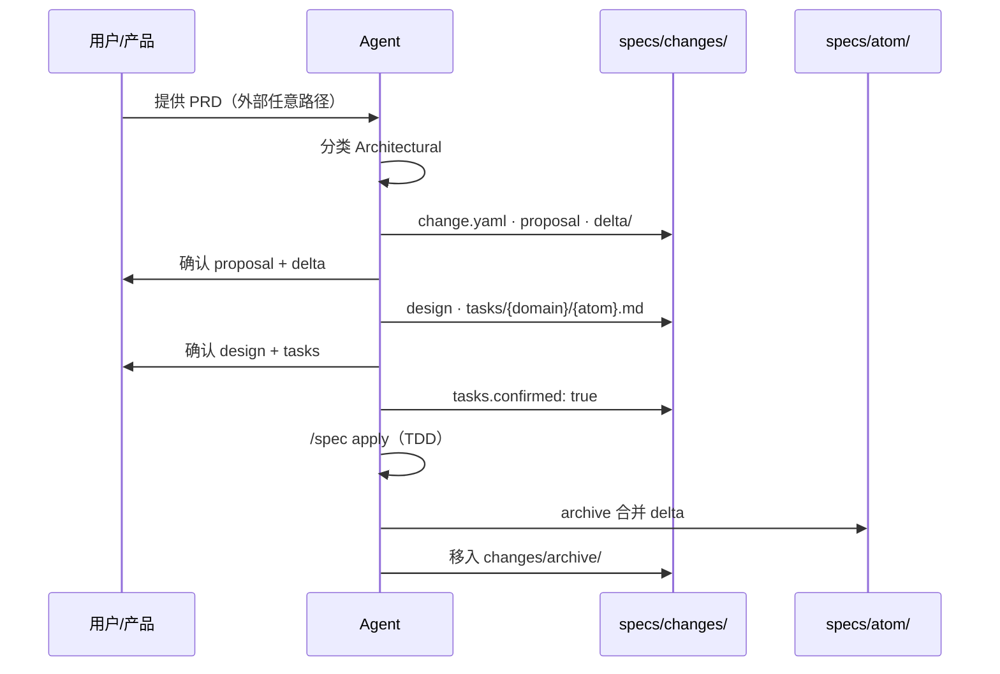

# PRD-Spec 工作流

> 本文描述 PRD-Spec 的端到端工作流。目录与格式细节见 [ARCHITECTURE.md](./ARCHITECTURE.md)。

---

## 1. 一句话

**PRD 说明产品要什么 → `change.yaml` 记录这次改什么 → 各 atom 的 `tasks/` 驱动 TDD 实现 → archive 将 delta 写入 `specs/atom/{domain}/{atom}.md` 作为真相源。**

所有本体系**产出**集中在 `specs/`；外部 PRD 可在仓库任意路径只读引用；代码在 `src/` 等目录。

---

## 2. 总览



| 阶段 | 做什么 | 产出位置 |
|------|--------|----------|
| 探索 | 澄清需求 | 对话；可选 `/spec explore` |
| 提案 | 定义改什么 | `specs/changes/{name}/` + `change.yaml` |
| 实现 | 按各 atom 的 tasks TDD | `src/` |
| 归档 | delta 合并为真相 | `specs/atom/{domain}/{atom}.md` |

---

## 3. 四条命令

| 命令 | 触发场景 | Agent 动作 |
|------|----------|------------|
| `/spec explore` | 需求不清晰 | 读 PRD/代码、提问澄清；**不写代码** |
| `/spec propose` | 新功能或 PRD 更新 | 路径分级 → 创建 `specs/changes/{name}/` + `change.yaml` |
| `/spec apply` | 设计已确认 | 按 `tasks/{domain}/{atom}.md` TDD 实现；`change.yaml` 设 `tasks.confirmed: true` |
| `/spec archive` | 实现完成 | delta → `specs/atom/`；`change.yaml` → archived；移入 `archive/` |

**典型主路径：**

```
explore（可选）→ propose → 用户确认 → apply → archive
```

---

## 4. 路径分级（Superpowers）

Agent 接到任务后**必须先分类**，写入 `change.yaml` 的 `path`，并口头告知用户。

| 路径 | 适用场景 | 流程厚度 | 主要产出 |
|------|----------|----------|----------|
| **Spike** | 可行性探索（「能不能…」「试一下」） | 最轻 | 口头/简短报告 |
| **Bounded** | 小改动（单 atom、单接口） | 轻 | `change.yaml` + `tasks/{domain}/{atom}.md` |
| **Architectural** | 新功能、PRD 驱动、跨模块 | 完整 | change 全套 artifact + archive |

### 升级规则（单向）

```
Spike ──需保留代码──► Bounded 或 Architectural
Bounded ──影响面扩大──► Architectural
```

任务中途发现复杂度超预期 → **立即升级路径**，不可降级。

### 确认门（按路径缩放）

| 路径 | 用户确认方式 |
|------|-------------|
| Spike | 口头确认探针方案 |
| Bounded | 聊天内 2–3 句设计 + 用户说「可以」 |
| Architectural | proposal → delta → design → **各 atom 的 tasks 文件**，每步确认 |

**铁律**：任何路径在写 `src/` 代码前，都必须有对应级别的用户确认；Architectural 路径**禁止**在 `change.yaml` 未设 `tasks.confirmed: true` 的情况下实现。

---

## 5. Architectural 完整流程（主路径）

以 PRD 驱动的新功能为例：产品文档 `PRD.md` 中新增「手机号验证码登录」。

### 5.1 propose — 定义「改什么」

Agent 创建 change 目录：

```
specs/changes/add-sms-login/
├── change.yaml           # ★ 变更记录：状态、PRD、atom 映射
├── proposal.md           # 为什么做、Scope In/Out
└── delta/
    └── auth/
        └── sms-login.md  # 镜像 specs/atom/auth/sms-login.md
```

`change.yaml` 中登记：

```yaml
prd_inputs:
  - path: PRD.md
    locate: "§3.1"
atoms:
  - domain: auth
    atom: sms-login
    operation: ADDED
    delta: delta/auth/sms-login.md
    tasks: tasks/auth/sms-login.md
    target: specs/atom/auth/sms-login.md
```

**用户确认点 1**：proposal、delta 与 `change.yaml` 的 atom 映射是否准确反映 PRD。

### 5.2 补充 design + tasks — 定义「怎么做」

```
specs/changes/add-sms-login/
├── design.md
└── tasks/
    └── auth/
        └── sms-login.md   # 与 delta/auth/sms-login.md 一一对应
```

**用户确认点 2**：design 与各 atom 的 tasks 是否可开始写代码。确认后 Agent 更新 `change.yaml`：`tasks.confirmed: true`。

### 5.3 apply — TDD 实现

Agent 按每个 `tasks/{domain}/{atom}.md` 逐项执行（Superpowers 粒度）：

1. 写失败测试
2. 运行，确认 FAIL
3. 写最小实现
4. 运行，确认 PASS
5. 勾选 checkbox，必要时 commit

代码写入 `src/`，**不在** `specs/` 内（除勾选 tasks checkbox）。

### 5.4 archive — 合并真相源

1. 确认各 `tasks/**/*.md` checkbox 全部完成；`change.yaml` 设 `tasks.complete: true`
2. 将 `delta/{domain}/{atom}.md` 合并到 `specs/atom/{domain}/{atom}.md`
3. 更新 `change.yaml`：`status: archived`，`archive.at` 填日期
4. 更新 `specs/README.md`（推荐）
5. 将整个 change（含 `tasks/` 历史）移至 `specs/changes/archive/YYYY-MM-DD-{name}/`

此后 **`specs/atom/{domain}/{atom}.md` 为对应需求单元的真相源**；`tasks/` 留在 archive 供审计，**不** merge 进 atom。

### 5.5 时序图



---

## 6. Artifact 依赖（OpenSpec enabler 模型）

```
proposal ──► change.yaml + delta ──► design ──► tasks/{domain}/{atom}.md ──► implement ──► archive
   why              what                  how              steps
```

| Artifact | 路径 | 回答的问题 |
|----------|------|-----------|
| `change.yaml` | `specs/changes/{name}/` | 状态、PRD 输入、atom 映射、门禁 |
| `proposal.md` | 同上 | 为什么做、做什么、不做什么 |
| `delta/` | 同上 | 相对 `specs/atom/` 的变更（路径镜像） |
| `design.md` | 同上 | 技术怎么做 |
| `tasks/` | 同上 | 各 atom 的实现步骤与 TDD 清单 |

- 箭头表示 **可以开始写下一个**，不是死板阶段门
- 任何时候可回头修改 proposal / design / `change.yaml`
- **implement 前**：`change.yaml` 中 `tasks.confirmed: true`，且相关 `tasks/**/*.md` 已获用户确认

### 活跃 change 期间的禁忌

有未 archive 的 change 时：

- ✅ 修改 `specs/changes/{name}/delta/`、`change.yaml`
- ❌ 直接修改 `specs/atom/`（应走 delta → archive）

---

## 7. Bounded 捷径流程

适用：改 TTL、加一个字段、修一个接口等**已有代码上的小改动**（通常单 atom）。

```
1. Agent 分类为 Bounded，聊天给出 2–3 句设计
2. 用户确认
3. 创建 specs/changes/fix-xxx/change.yaml + tasks/{domain}/{atom}.md
   （可省略 proposal/design/delta）
4. change.yaml: tasks.confirmed: true → /spec apply
5. 若行为规格有变 → 补 delta + archive；若无变 → 可只提交代码
```

---

## 8. Spike 捷径流程

适用：「Redis 能否扛住 QPS」「这个 SDK 是否支持某某」等**探针式**任务。

```
1. Agent 分类为 Spike，口头说明探针方案
2. 用户点头
3. 尽可能低成本验证（代码标为 throwaway）
4. 输出结论报告
5. 若要保留代码 → 重新分类为 Bounded 或 Architectural，不得静默当作已完成需求
```

Spike 通常**不**创建完整 change 目录；若需留痕，可建最小 `change.yaml`（`path: spike`）仅记摘要。

---

## 9. PRD 如何进入工作流

| 环节 | 说明 |
|------|------|
| **输入位置** | 仓库任意路径（`PRD.md`、`requirements/` 等）或外部 URL |
| **登记** | `change.yaml` 的 `prd_inputs`；可选全局 `specs/prd-index.md` |
| **映射** | `change.yaml` 的 `atoms[]`：PRD 段落 → delta/tasks → target atom |
| **解析** | 不假设固定章节；从列表、表格、用户故事抽取 Requirement + Scenario |
| **增量更新** | PRD 变更 → 新建 change → 只写受影响 `delta/` 与配对 `tasks/` |

### PRD → Spec 映射（语义级）

| PRD 内容 | 落点 |
|----------|------|
| 背景、目标、用户故事 | `Purpose`、proposal `Intent` |
| 功能点、业务规则 | `Requirement`（写入 delta） |
| 边界、异常、数值限制 | `Scenario`（GIVEN/WHEN/THEN） |
| 不做、后续版本 | proposal `Out`、`Non-Goals` |
| 未提及 | `[待确认]`，不编造 |

### 增量 PRD 更新步骤

1. 对比 `specs/prd-index.md` 中登记的有效输入组合
2. Agent 语义 diff（无需专用 CLI）
3. 新 change 的 `change.yaml` 更新 `atoms[].operation`（ADDED / MODIFIED / REMOVED）
4. 只更新受影响的 `delta/{domain}/{atom}.md` 与配对 `tasks/{domain}/{atom}.md`
5. propose → apply → archive

---

## 10. Agent 执行规则（Skill 实现清单）

1. **先分类**：Spike / Bounded / Architectural，写入 `change.yaml` 的 `path`，告知用户
2. **先确认再写代码**：确认门厚度随路径缩放
3. **产出归 specs**：`change.yaml`、proposal、design、tasks、delta、索引均在 `specs/` 下
4. **PRD 驱动**：Architectural 路径须有 `change.yaml`（`prd_inputs` + `atoms`）
5. **TDD**：各 `tasks/{domain}/{atom}.md` 采用红→绿→重构粒度
6. **映射同步**：`change.yaml` 的 `atoms[]` 与 `delta/`、`tasks/` 路径保持一致
7. **首次 propose**：若尚无 `specs/`，从 `templates/specs-README_template.md` 初始化 `specs/README.md`（推荐）
8. **archive 后**：更新 `specs/README.md` atom 表与进行中 change 表（推荐）

---

## 11. 多人协作

| 场景 | 策略 |
|------|------|
| A、B 改不同 atom | 各自 `specs/changes/{name}/`，archive 无冲突 |
| A、B 改同一 atom | Git PR 冲突；以最新 PRD 重跑 propose |
| 有人直接改 `specs/atom/` | 有活跃 change 时禁止；应改 `delta/` |
| 产品更新 PRD | 新建 change，不直接改 atom |

---

## 12. 与 OpenSpec / Superpowers 的对应

| 来源 | PRD-Spec 采用 |
|------|---------------|
| **OpenSpec** | `specs/atom/` 真相源 + `changes/` delta + archive 合并 |
| **Superpowers** | 三级路径分级 + 按 atom TDD tasks + 先确认再实现 |

| 刻意做轻 | 说明 |
|----------|------|
| 无专用 CLI | Agent + YAML change + Markdown |
| 无全局状态机 | 每 change 一个 `change.yaml` + git |
| PRD 读散写聚 | 外部 PRD 任意路径；产出只在 `specs/` |
| 混合格式 | YAML 管映射/状态；MD 管 spec 正文与 TDD |

---

## 13. 相关文档

| 文档 | 内容 |
|------|------|
| [ARCHITECTURE.md](./ARCHITECTURE.md) | 目录结构、Spec 格式、模板、设计决策 |
| [templates/](./templates/) | change.yaml、proposal、delta、tasks 等模板 |
| [README.md](./README.md) | 快速导读 |
